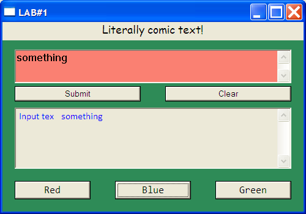

# Event-Driven Programming Laboratory Work #1

## Title

Window. Window handling. Basic window’s form elements

## Contents

* Win32 API
* `git`
* Programming Style Guidelines
* Window
* Button
* Text Input
* Text

## Realised Mandatory Objectives

* Choose a _Programming Style Guideline_ that you'll follow
* Create a `Windows application`
* Add 2 `buttons` to window: one with default styles, one with custom styles (size, background, text color, font family, font size)
* Add 2 `text` elements to window: one with default styles, one with custom styles (size, background, text color, font family, font size) *[one of them should be something funny]*
* On windows resize, one of the `text`s should "reflow" and be in window's center (vertically and horizontally)

## Realised Objectives With Points

* Add 2 text inputs to window: one with default styles, one with custom styles (size, background, text color, font family, font size) `(1pt)`
* Make elements to fit window on resize `(1 pt)`
* Make elements to interact or change other elements (`1 pt` each different interactions) `(0-2 pt)` _(3 buttons for changing text color)_
* Change behavior of different window actions (at least 3). _(when closed, the app pops a message and waits for confirmation)_ `(1 pt)`

## My windows app

* Input text in the top textbox
* Append text from the first textbox to the second with the [Submit] button
* Clear the second textbox with the [Clear] button
* Change text color of the second textbox with [Red], [Green], [Blue] buttons.
* Elements fit on window resize
