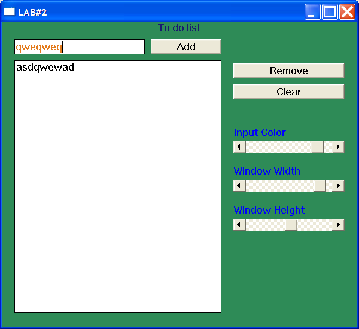

# Windows Programming Laboratory Work #2

## Title
Advanced Form Elements. Child Windows. Basics of Working With Keyboard.

## Contents
* The Keyboard
* Child Window Controls
  * Scroll Bar
  * Listbox
* Menus and Other Resources
* Dialog Boxes

## Realised Mandatory Objectives
 * Display a dialog box on some event (info on Ctrl+I)
 * Add a system menu to your application with at least 3 items (add actions to that items)
 * Add a scroll bar that will change any visible parameter of any other element (color of input field)
 * Hook keyboard input. Add 2 custom events for 2 different keyboard combinations (close on Ctrl+Q, info on Ctrl+I) 
 
## Realised Objectives With Points
 * Add a listbox `(1 pt)`
 * Add 2 scroll bars that will manage main window size or position `(1 pt)`
 * Customize your application by adding an icon and using different cursor in application `(1 pt)`
 * Use a scroll bar to scroll through application working space. Scroll should appear only when necessary (eg. when window width is smaller than 300px) `(1 pt)`
 
 ## My windows app

* Input text in the top field, change it's color with the scrollbar, add it to the listbox with [Add] button
* Remove an element or clear the entire list with [Remove], [Clear] buttons
* Clear the second textbox with the [Clear] button
* Resize window with last 2 scrollbars
