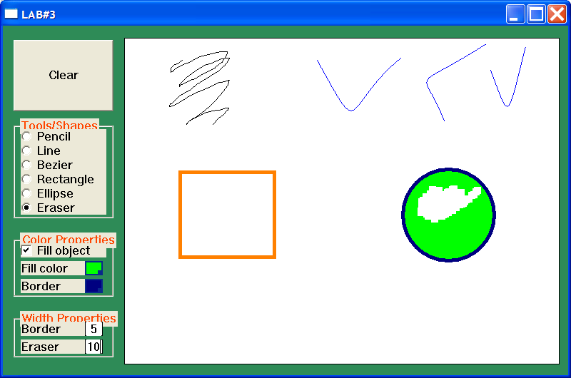

# Windows Programming Laboratory Work #3

## Title
Basics of Working with Mouse. GDI Primitives. Bezier Curve.

## Contents
* Mouse
* Device context
* GDI Primitives
  * Line
  * Curve
  * Plane
  * Bitmap image
* Bezier curve

## Mandatory Objectives
* Draw few lines of different colors and weights
* Draw a Bezier curve
* Draw few plane objects (ex. circle, square, pie, polygon...) of different colors, weights, filled and not
* Draw 2 different objects using mouse

## Objectives With Points
* Draw a custom bitmap image `(1 pt)`
* Add a switch (button, select list...) that will change mouse ability to draw objects `(2 pt)`
* Draw a Bezier curve using mouse `(1 pt)`
* Fill an object with a gradient `(1 pt)`
* Use mouse as an eraser of:
  * a fixed width `(1 pt)`
  * a adjustable width `(2 pt)`

## My windows app

* Left border Menu for:
  * Clear the drawing area
  * Tools and Shapes
  * Color Properties
  * Width Properties
* Drawing area
