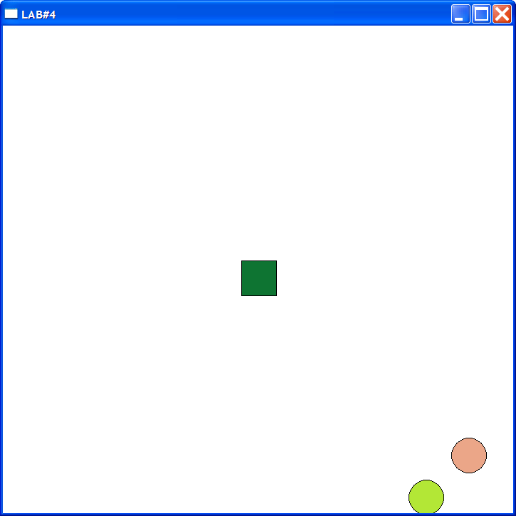

# Windows Programming Laboratory Work #4

## Title
Windows Timer. Animation.

## Contents
* Windows timer

## Mandatory Objectives
* Create an animation based on Windows timer which involves at least 5 different drawn objects

## Objectives With Points
* Increase and decrease animation speed using mouse wheel `(2 pt)`
* Solve flickering problem `(2 pt)`
* Add animated objects which interact with each other `(2-6 pt)`, ex.:
  * Few balls which have different velocity and moving angles. In order to get max points, add balls with mouse, make balls to change color on interaction and any other things that will show your engineering spirit

## My windows app

* Add more balls with left mouseclick
* Increase / decrease speed with mousewheel
* Random colors / velocity
* The balls change shape on impact
* Tne balls interact with each other
